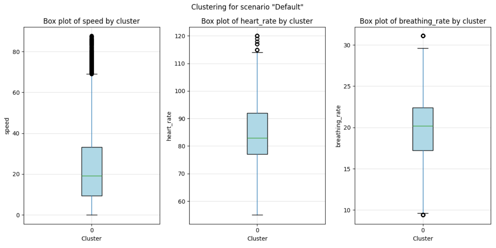
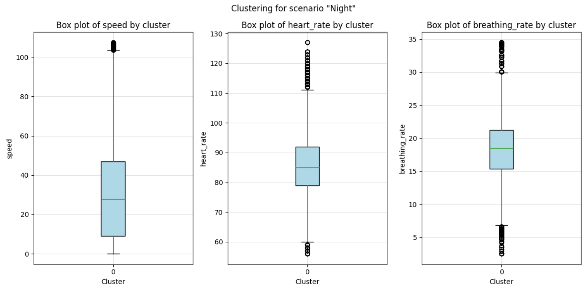
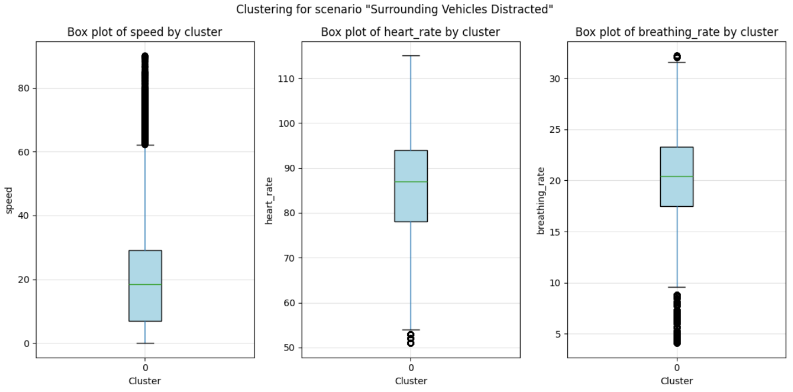
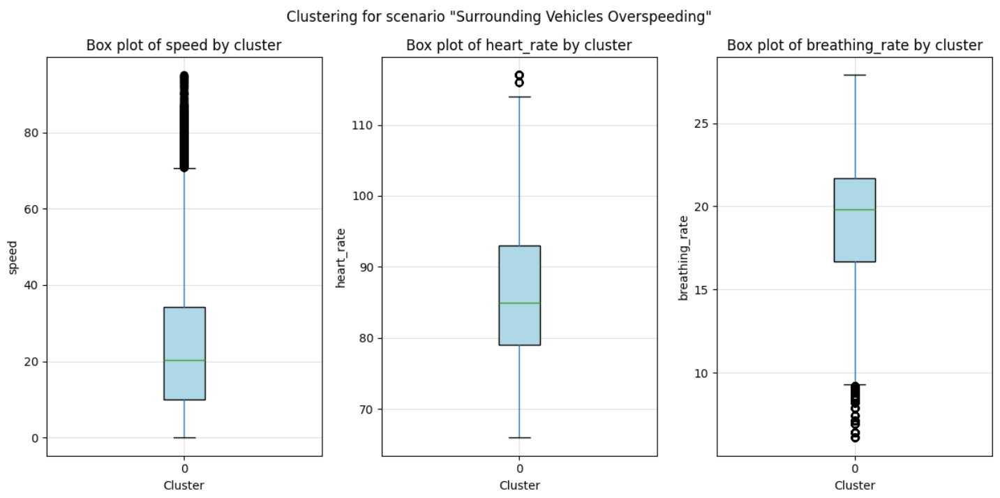
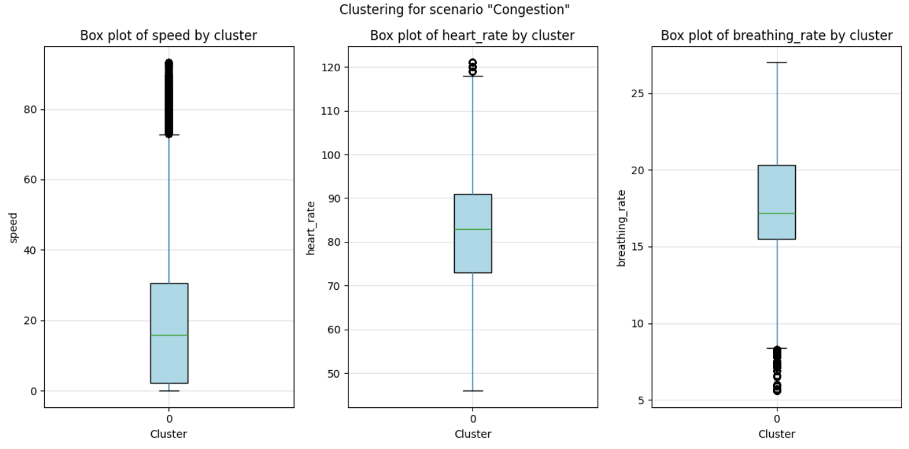

# Crowd Behavior Study via CARLA #

## Abstract ##
This study aims to evaluate the physiological impacts of interacting with drivers exhibiting varying behaviors on an individual operating a vehicle within a simulated environment. We will collect biometric data from the individual including heart rate variability (HRV). In this way, we will assess how stressed an individual is in varying conditions. Specific behaviors will be modeled in the simulation, including aggressive drivers whose presence is hypothesized to increase the stress level of the individual driving. Behaviors of aggressive drivers will include but are not limited to, speeding, frequent lane changes, tailgating, etc. The primary objective is to assess whether and how the social dynamics of road interactions influence a driver’s physiological responses. Furthermore, this research will investigate how environmental factors such as the weather and the speed limit will separately and in combination with one another affect the physiological responses of the driver. The findings are expected to provide insights into how different driving scenarios can be stress-inducing, thereby affecting the overall traffic flow and safety of the system.

## Motivation ##
We would like to analyze the effects, if any, of drivers with varying behaviors on an individual driving in various scenarios. We will collect the biometric data of the individual sitting behind a vehicle and driving in a simulation environment. We will simulate other drivers with various “temperaments”. For example, aggressive drivers will have higher speeds and more lane changes. The goal is to see if the social behaviors of various vehicles change the biometric data of the driver and in what way. In this way, we can conclude how stress-inducing various driving scenarios can be. Ultimately, for each scenario, we will have an n number of different speed limits for which we will see if varying the speed limit will impact the biometric data of the driver. We will also do this for the weather by noting the differences in biometric data when it is sunny versus when it is raining.

## Design Goals ##
- Create different scenarios with drivers with different behaviors. There will be four different scenarios: no aggressive drivers (i.e. all drivers follow the rules), 25% aggressive drivers, 50% aggressive drivers, and 75% aggressive drivers.
- In CARLA, change vehicle attributes, such as speed, number of lane changes, tailgating, running red lights and stop lights, honking excessively, etc.
- For each scenario, run it for n number of different speed limits.
- For each scenario, run it for sunny weather and then for rainy weather.
- Combine the different speed limits with the different weather conditions and see the effects

## Deliverables ##

- Research and execute various traffic scenarios using the CARLA autonomous driving simulator. Focus on integrating realistic traffic conditions to test autonomous driving systems.
- Gather and analyze data related to driving behavior patterns and human biometrics such as heart rate. The aim is to develop a model that can classify and predict driver behavior over time.
- Conduct a comprehensive case study demonstrating real human driving behaviors under different traffic conditions. This study will help in understanding the impact of crowd densities on driving patterns and stress levels

## System Blocks ##

## Project Timeline ##

## Hardware and Software Requirements ##
Hardware requirements include:

- G920 Driving wheel
- GTrack Driving seat
- Logitech Driving pedals
- 50’ TV
- PC installed with CarlaUE4
- Human Biometric reader belt

Software requirements include
- CARLA Simulator
- Matlab
## Goal ##
- Research and implement traffic scenarios on the CARLA simulator.
- Gather data on human biometrics, such as heart rate, stress levels, and vehicular metrics like speed and acceleration, to analyze and classify driving behavior.
- Case Study on driving behavior across various traffic conditions.

## Driving Scenarios ##
* Default environment -  control sample
* Driving at Night
* Vehicles Overspeeding
* Distracted Vehicles
    * Ignoring Traffic Lights
    * Ignoring Stop Signs
* Congested Driving
    * Overcrowded roads
    * Overcrowded intersections
## Final Results ##
### Default Driving ###

### Night Driving ###

### Surrounded by Distracted Drivers ###

### Surrounded by Overspeeding Drivers ###

### Driving in Congested Traffic ###

## Summary of Results ##
For Default versus when the surrounding vehicles are overspeeding, the heart rate increases from an average of 82 bpm in the default scenario to 86 bpm when surrounding vehicles are overspeeding. This suggests a slight elevation in stress levels possibly due to the increased pace and potential perceived risk of the driving environment.

For default versus when the surrounding vehicles are distracted, an even larger increase in heart rate is observed, from 82 bpm to 88 bpm. This indicates that drivers may experience higher stress or anxiety when nearby drivers are distracted, possibly due to the unpredictability and increased perceived danger this scenario introduces.

For default versus congestion, there’s a minor increase in average speed from 20 km/h to 17 km/h in congestion. This speed reduction is typical of congested traffic conditions and reflects the restricted movement and potential frustration or stress associated with such environments.

For default versus night driving, night driving results in a significant tendency to overspeed, over 40% higher compared ot the default. This could be due to less traffic and possibly overconfidence in less visually restrictive conditions. The average heart rate during night driving increases to 85 bpm, indicating elevated stress possibly due to the increased speed and the challenges of lower visibility. The average breathing rate decreases from 22 breaths per minute in the default scenario to 17 breaths per minute during night driving, which might indicate a calmer respiratory state despite the increased heart rate. This could be a result of concentration or focus required during night driving, which might lead to more controlled breathing.

## Team Members Responsibilities ##
### Puya: ### 
Data collection configuration, Test drive of the simulation, Setting up simulation constraints
### Yasamin: ### 
Research and Design algorithms for the analysis required on collected data, Test drive the simulation, Set up simulation constraints.
### Ruchi: ### 
Documentation of Data collection from simulation, Test drive of the simulation, and Organization of the collected data to be analyzed. 
### Sauryadeep: ###
Research and Design algorithms for the analysis required on collected data, Test drive the simulation, Setting up simulation constraints.
### Aniruddha: ###
Data collection configuration, Test drive of the simulation, Setting up simulation constraints.

## References ##
<a id="1">[1]</a>  Y. Xia, M. Geng, Y. Chen, B. Zhang, Z. Gao, and X. (M.) Chen, "Understanding common human driving semantics for autonomous vehicles," IEEE Transactions on Intelligent Transportation Systems, 2023.

<a id="1">[2]</a>  E. Aria, J. Olstam, and C. Schwietering, "Investigation of Automated Vehicle Effects on Driver’s Behavior and Traffic Performance," IEEE Transactions on Intelligent Transportation Systems, 2016.

<a id="1">[3]</a>  S. Montanaro, E. Santoro, E. Landolfi, F. Pascucci, and C. Natale, "A Hybrid Approach Based on Behavioural and Physiological Data for Driver Monitoring Systems," IEEE Transactions on Intelligent Transportation Systems, 2022.

<a id="1">[4]</a>  M. H. Alkinani, W. Z. Khan, and Q. Arshad, "Detecting Human Driver Inattentive and Aggressive Driving Behavior Using Deep Learning," IEEE Transactions on Intelligent Transportation Systems, 2020.

<a id="1">[5]</a>  G. Li, L. Yang, S. Li, X. Luo, X. Qu*, and P. Green, "Human-Like Decision Making of Artificial Drivers in Intelligent Transportation Systems: An End-to-End Driving Behavior Prediction Approach," IEEE Transactions on Intelligent Transportation Systems, 2021.

<a id="1">[6]</a>  N. Li, J. J. Jain, and C. Busso, "Modeling of Driver Behavior in Real World Scenarios Using Multiple Noninvasive Sensors," IEEE Transactions on Intelligent Transportation Systems, 2013.

<a id="1">[7]</a>  M. Minen, L. Gregoret, D. Seernani, and J. Wilson, "Systematic Evaluation of Driver’s Behavior: A Multimodal Biometric Study," IEEE Transactions on Intelligent Transportation Systems, 2023.
